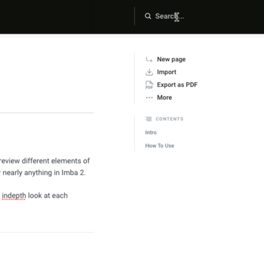

# How to use docs.imba.io?

## How To Use

👈 Browse through the pages on the left to find different subjects

👉 On the right, you can navigate through the headers of each page. 

🔎 Use the search on the top right if you need to quickly find something you lost.

## 

