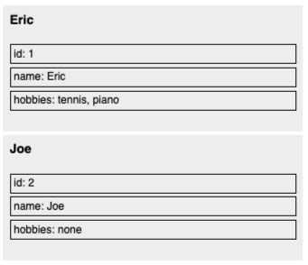

# Loops

Loops in Imba behaves similar to array comprehensions in CoffeeScript and Python. They are expressions, and can be returned and assigned. When used as expressions they will always return an array \(like Array\#map, but with a few additional powerful features, like break / continue\).

### for in

```ruby
let languages = ['Imba', 'Svelte', 'Javascript']

for item in languages
    console.log item

tag app-root
    def render
        <self>
            <ul>
                for item in languages
                    <li> item
```

> [See on Scrimba](https://scrimba.com/c/cv8Mvau8)

## Keys of Object

```ruby
# iterate through keys of object
for key,value of {a: 1, b: 2}
    console.log key + ": " + value * 2

# prints:
# a: 2
# b: 4
```

## While Loop

```ruby
while true
    break if Math.random < 0.1
```

> 🎮 [Play with the code on Scrimba](https://scrimba.com/c/ceMgLbUN)

## Until Loop

```ruby
let counter = 0
until Math.random() < 0.1
    counter++
```

> [🎮 Play with the code on Scrimba](https://scrimba.com/c/cZPNedCD)

## Loop with Index Argument

```ruby
# looping with index argument
for item, i in [1,2,3]
    console.log i + ": " + item * 1

# prints:
# 0: 1
# 1: 2
# 2: 3
```

## Loop Expressions

```ruby
# loops are expressions
var list = [1,2,3,4,5]
var doubles = for num in list
    num * 2
console.log doubles

# prints:
# [2,4,6,8,10]
```

## Loop with Intervals

```ruby
# go through every other element
for item in [1,2,3,4,5] by 2
    item * 2
    console.log item

# prints:
# 1
# 3
# 5
```

## Filter by Condition

```ruby
# filter by condition
let list = [1,2,3]
for num in list when num > 1
    console.log num
# prints:
# 2
# 3
```

> **Tip!** Any type of object can support being iterated with forin in Imba. If the compiler does not know that the target is an array \(at compile-time\) it will look for \(and call\) `target.toArray`if it exists, and then loop through this.

## Loop Over Own Keys \(for of\)

The following example will render the names of the keys along with the values of the properties of each object.

```ruby
let users = [
    id: 1
    name: "Eric"
    hobbies: [
        "tennis"
        " piano"
    ]
    ---
    id: 2
    name: "Joe"
    hobbies: [
        "none"
    ]
]
tag app-root
    def render
        <self>
            for user in users
                <div> 
                    <h3> user.name
                    <ul> for own key, item of user
                        <li> "{key}: {item}"
```

> [Play with the code on Scrimba](https://scrimba.com/c/cD7aJmuW)



## Loop Over All Keys \(for of\)

```ruby
# loop over all keys of object
var object = {a: 1, b: 2, c: 3, d: 4}
for k,value of object
    console.log "{k} 👉 " + value

# prints:
# a 👉 1
# b 👉 2
# c 👉 3
# d 👉 4
```

## Continue

Continue without Arguments

```ruby
var result = for num in [1,2,3,4,5]
    continue if num == 3
    num * 2
console.log result
# prints
# [2,4,8,10]
```

Continue with an Argument

```ruby
var result = for num in [1,2,3,4,5]
    continue -1 if num == 3
    num * 2
console.log result
# acts like early return within map

# prints:
# [2,4,-1,8,10]
```

## Break

Break without arguments

```ruby
var result = for num in [1,2,3,4,5]
    break if num is 3
    num
console.log result

# prints:
# [1,2]
```

Break with Argument

```ruby
var result = for num in [1,2,3,4,5]
    break 'done' if num is 3
    num
console.log result

# prints:
# [1,2, "done"]
```

